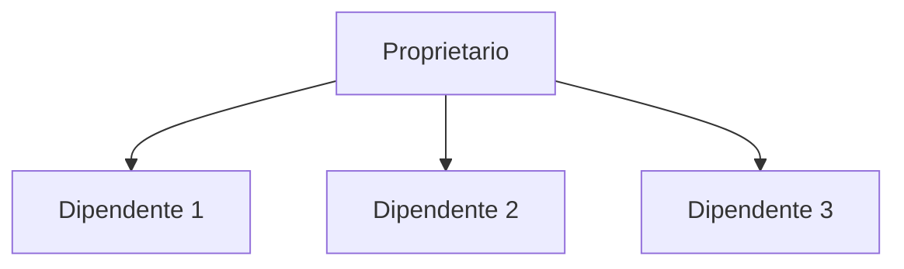
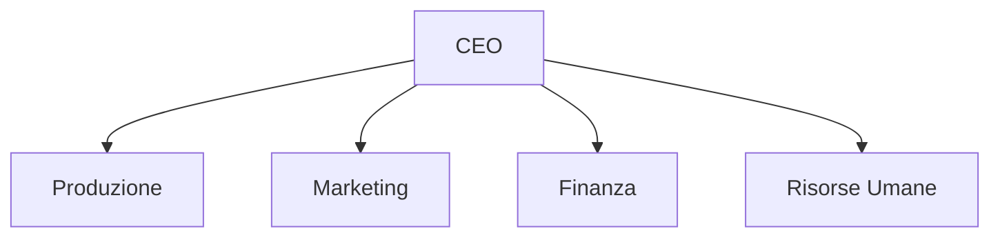
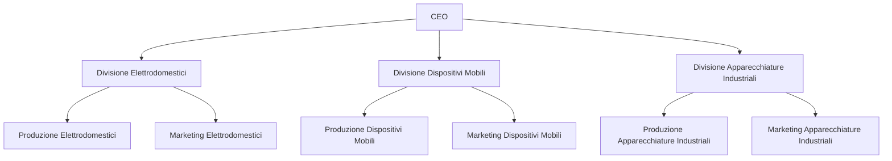
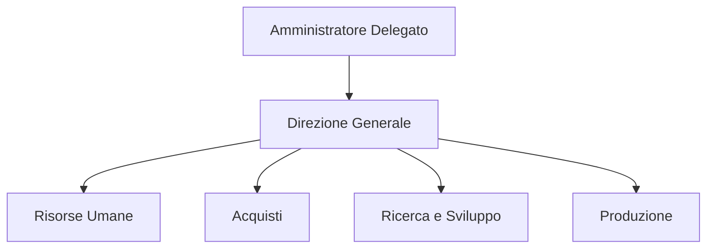
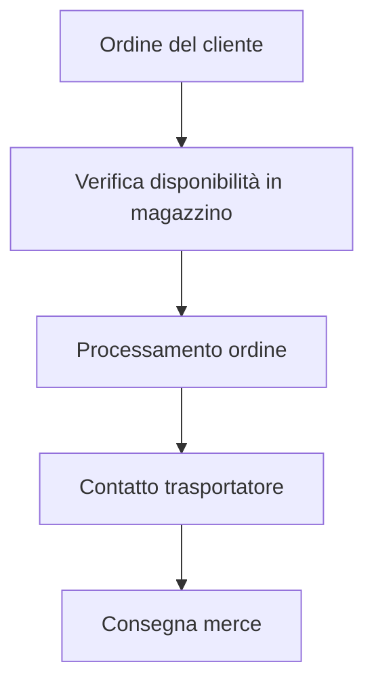
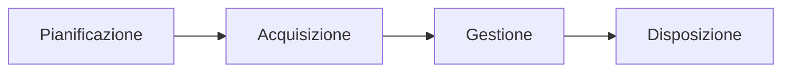

Ecco la riorganizzazione del testo con enfasi e markup adatti per Obsidian:

---

# Elementi di Organizzazione Aziendale

## Meccanismi di Coordinamento
Per coordinare efficacemente le attività all'interno di un'organizzazione, è essenziale comprendere e implementare diversi meccanismi di coordinamento. Questi includono:

- **Supervisione diretta:** Un responsabile che guida e controlla direttamente il lavoro dei subordinati.
- **Standardizzazione dei processi:** Definizione di procedure e metodi standard per eseguire le attività.
- **Standardizzazione dei risultati:** Stabilire obiettivi chiari e misurabili per i risultati attesi.
- **Standardizzazione delle competenze:** Formazione e qualificazione degli operatori per garantire che abbiano le competenze necessarie.
- **Mutuo adattamento:** Comunicazione informale tra membri del team per coordinarsi.

## Tipologie di Strutture Organizzative

Riconoscere le diverse tipologie di strutture organizzative è cruciale per adattarsi al meglio alle esigenze aziendali. Le principali strutture organizzative sono:

### Struttura Semplice

**Descrizione:** 
La struttura semplice è caratterizzata da una bassa formalizzazione e una supervisione diretta. Di solito, questa struttura è utilizzata da piccole imprese o start-up dove il controllo centralizzato è necessario.

**Esempio:**
Una piccola impresa familiare dove il proprietario prende tutte le decisioni e dirige direttamente i dipendenti.

**Diagramma:**

### Struttura Funzionale

**Descrizione:**
La struttura funzionale organizza l'azienda per funzioni o aree di competenza. Ogni dipartimento è responsabile di una specifica funzione aziendale come marketing, produzione, finanza, ecc.

**Esempio:**
Un'azienda manifatturiera con reparti distinti per produzione, marketing, finanza e risorse umane.

**Diagramma:**

### Struttura Divisionale

**Descrizione:**
La struttura divisionale è suddivisa per prodotto, mercato o area geografica. Ogni divisione opera come un'entità semi-indipendente con le proprie risorse e obiettivi.

**Esempio:**
Una multinazionale che produce elettronica di consumo e ha divisioni separate per elettrodomestici, dispositivi mobili e apparecchiature industriali, ciascuna con il proprio team di marketing e produzione.

**Diagramma:**

### Struttura a Matrice

**Descrizione:**
La struttura a matrice combina due forme di strutture organizzative, come la funzionale e la divisionale. I dipendenti hanno più di un responsabile, riportando sia ai manager funzionali sia ai manager di progetto o di prodotto.

**Esempio:**
Un'azienda tecnologica che sviluppa nuovi prodotti con team di progetto che includono membri dei reparti di ingegneria, marketing, e finanza.

**Diagramma:**

Ogni struttura ha i suoi vantaggi e svantaggi, e la scelta della struttura più appropriata dipende dalle dimensioni dell'azienda, dalla complessità delle operazioni e dagli obiettivi strategici.

## Processi Aziendali
### Definizione di Processo
Un **processo** è un insieme di attività correlate che trasformano input in output, aggiungendo valore. I processi possono essere suddivisi in:

- **Processi primari:** Direttamente coinvolti nella produzione di beni o servizi.
- **Processi di supporto:** Supportano i processi primari e includono funzioni come gestione risorse umane e IT.
- **Processi di gestione:** Coinvolgono la pianificazione, monitoraggio e controllo delle attività aziendali.

### Modellazione di un Processo Aziendale
Per modellare un semplice processo aziendale, segui questi passaggi:

1. **Identificazione del processo:** Definisci chiaramente il processo da modellare.
2. **Mappatura delle attività:** Elenca tutte le attività necessarie per completare il processo.
3. **Definizione degli input e output:** Identifica le risorse e i risultati di ciascuna attività.
4. **Sequenza delle attività:** Organizza le attività in una sequenza logica.

Esempio di diagramma di flusso per un processo aziendale:

## Risorse Aziendali
### Definizione di Risorsa
Una **risorsa** è qualsiasi elemento con cui l'azienda opera per perseguire i propri obiettivi. Le risorse si classificano in:

- **Risorse esterne:** Ambiente sociale ed economico, mercato, clienti.
- **Risorse interne:** Di scambio (prodotti e servizi), di struttura (finanze, persone, infrastrutture), di gestione (norme, organigrammi, deleghe, piani, informazioni).

### Ciclo di Vita delle Risorse
Le risorse aziendali attraversano diverse fasi nel loro ciclo di vita:

1. **Pianificazione:** Definizione e identificazione delle necessità.
2. **Acquisizione:** Assunzione o approvvigionamento.
3. **Gestione:** Utilizzo e manutenzione delle risorse.
4. **Disposizione:** Ritiro o sostituzione delle risorse.

Esempio di ciclo di vita delle risorse:

## Importanza delle Informazioni nei Processi Aziendali
Le informazioni sono essenziali per il funzionamento dei processi aziendali. La conoscenza delle risorse e dei processi è fondamentale per la pianificazione, gestione e miglioramento continuo delle attività aziendali.

---